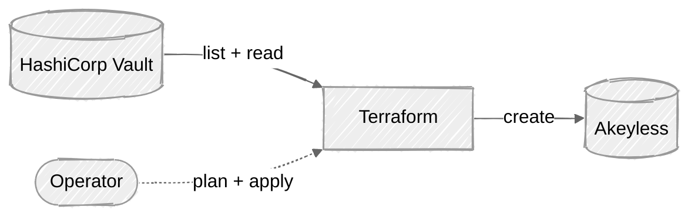

# vault-to-akeyless-dynamic-secrets

Read your dynamic secret config out of HashiCorp Vault, create the matching objects in Akeyless. Pure Terraform: the `vault` provider does the reading, the `akeyless` provider does the writing.

## Architecture



Vault is the source of truth you already have. On every run, Terraform enumerates the dynamic secret config there, copies the identity bits it needs, and creates one Akeyless target plus one Akeyless dynamic secret per Vault entity. The parent service account credential that Akeyless will use to mint per-lease values is something you hand in as a sensitive Terraform variable.

Discovery is live. The Terraform talks to Vault on every plan via the Vault HTTP API (`?list=true`), so there is nothing for you to keep in sync. An empty Vault path returns 404 and is silently treated as "nothing of that kind to migrate."

## Mapping

| Vault entity                              | Akeyless object                                              | Notes                                                                                                |
|-------------------------------------------|--------------------------------------------------------------|------------------------------------------------------------------------------------------------------|
| `gcp/static-account/<name>`               | `akeyless_dynamic_secret_gcp` (fixed SA, token or key)       | `gcp_sa_email` is copied from Vault. `gcp_cred_type` is derived from Vault's `secret_type`.          |
| `gcp/impersonated-account/<name>`         | `akeyless_dynamic_secret_gcp` (fixed SA, access token)       | `gcp_sa_email` is copied from Vault. Always `gcp_cred_type = "token"`.                               |
| `gcp/roleset/<name>`                      | `akeyless_dynamic_secret_gcp` (override required)            | Vault rolesets mint a fresh SA per lease, so there is no static email to copy. You give one durable SA email per roleset via `var.roleset_sa_overrides`. |
| Parent SA JSON for the Akeyless target    | `akeyless_target_gcp.gcp_key` (base64-encoded)               | Passed as a sensitive tfvar. The Terraform base64-encodes it for you.                                |

### Why rolesets need an override

A Vault roleset creates a brand new Google service account on every lease and tears it down on revoke, so the email is ephemeral. Akeyless dynamic secrets need a long-lived email up front. The migration handles this by asking you to pre-create one durable SA per roleset (with bindings equivalent to what the roleset granted) and to pass its email in via `var.roleset_sa_overrides`. If a roleset is found in Vault and you have not supplied an override for it, plan fails with a clear error that names the missing entries so you can fill them in and retry.

## Project structure

```
vault-to-akeyless-dynamic-secrets/
├── README.md
├── .gitignore
├── gcp/                          # ready
│   ├── README.md
│   ├── main.tf
│   ├── variables.tf
│   ├── data.tf
│   ├── locals.tf
│   ├── target.tf
│   ├── dynamic_secrets.tf
│   ├── outputs.tf
│   └── terraform.tfvars.example
├── aws/                          # coming soon
│   └── README.md
└── azure/                        # coming soon
    └── README.md
```

## Prereqs

- Terraform 1.5 or newer.
- Vault access:
  - Server URL via `var.vault_address`, or `export TF_VAR_vault_address="$VAULT_ADDR"`.
  - Token with `read` plus `list` on `<mount>/static-account`, `<mount>/impersonated-account`, `<mount>/roleset` and the per-entity paths, via `var.vault_token` or `export TF_VAR_vault_token="$VAULT_TOKEN"`.
- Akeyless access:
  - An access ID that can create targets and dynamic secrets under the path prefix you pick.
  - The default provider config uses the GCP-SA auth method. If you are not running on a GCE host bound to your Akeyless gateway, swap the login block in `gcp/main.tf` for `api_key_login` or another supported method.
- The parent SA JSON for the Akeyless GCP target. The gcloud command and the IAM roles it needs are in `gcp/README.md`.

## Quickstart (GCP)

```bash
cd gcp/
cp terraform.tfvars.example terraform.tfvars
# edit terraform.tfvars: set akeyless_access_id, paths, parent_sa_credentials
export TF_VAR_vault_address="$VAULT_ADDR"
export TF_VAR_vault_token="$VAULT_TOKEN"
terraform init
terraform plan
# review the planned akeyless_target_gcp + akeyless_dynamic_secret_gcp resources
terraform apply
```

If any roleset is missing an override, plan fails before it does anything. The error message names the rolesets you need to add to `var.roleset_sa_overrides`.

## Status

| Module  | Vault mount | Status      | Notes                                                                                |
|---------|-------------|-------------|--------------------------------------------------------------------------------------|
| `gcp/`  | `gcp/`      | Ready       | static-account, impersonated-account, roleset (with operator-supplied SA overrides). |
| `aws/`  | `aws/`      | Coming soon | Will follow the GCP pattern for IAM users, assumed roles, and federation tokens.     |
| `azure/`| `azure/`    | Coming soon | Will follow the GCP pattern for Azure service principal rolesets.                    |
