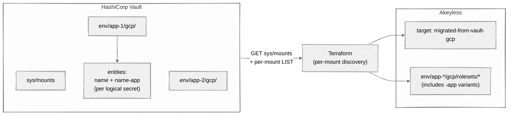

# vault-to-akeyless-dynamic-secrets

Read your dynamic secret config out of HashiCorp Vault, create the
matching objects in Akeyless. Pure Terraform: the `vault` and `http`
providers do the reading, the `akeyless` provider does the writing.

## Architecture



Discovery is live. Every plan re-reads `sys/mounts`, filters to mounts
of `type=gcp`, and walks each mount for `static-account`,
`impersonated-account`, and `roleset` entries. There is no
operator-maintained inventory; adding or removing a Vault mount adds
or removes the corresponding Akeyless dynamic secrets on the next
`terraform apply`.

## Naming

Every migrated dynamic secret is named:

```
<env>/<app>/gcp/rolesets/<entity_name>
```

`<env>` and `<app>` come from the first two segments of the Vault mount
path (`<env>/<app>/gcp/`). All three Vault entity types collapse into
the same Akeyless folder.

Each app has one Vault GCP mount. The Kubernetes vs non-Kubernetes
split lives at the entity level: by convention, `<entity_name>` is the
non-Kubernetes variant and `<entity_name>-app` is the Kubernetes
variant, both under the same `<env>/<app>/gcp/` mount. The migration
mirrors each entity to its own Akeyless dynamic secret, so a logical
secret with both runtime variants produces two dynamic secrets.

| Vault entity                       | Akeyless dynamic secret                              | `gcp_cred_type`                                                    |
|------------------------------------|------------------------------------------------------|--------------------------------------------------------------------|
| `gcp/static-account/<name>`        | `<env>/<app>/gcp/rolesets/<name>`                    | `key` if Vault `secret_type=service_account_key`, else `token`.    |
| `gcp/impersonated-account/<name>`  | `<env>/<app>/gcp/rolesets/<name>`                    | Always `token`.                                                    |
| `gcp/roleset/<name>`               | `<env>/<app>/gcp/rolesets/<name>`                    | Always `token`. SA email comes from `var.roleset_sa_overrides`.    |
| Parent SA JSON                     | `akeyless_target_gcp.migrated_from_vault.gcp_key`    | Single shared target (default `migrated-from-vault-gcp`).          |

Vault rolesets create a fresh service account per lease, so there is no
static email on the Vault side. The operator pre-creates one durable SA
per `(env, app, roleset)` tuple and supplies the email via
`var.roleset_sa_overrides`. See
[`gcp/runbooks/05-roleset-durable-sa.md`](gcp/runbooks/05-roleset-durable-sa.md).

## Project structure

```
vault-to-akeyless-dynamic-secrets/
|-- README.md                           # this file
|-- .gitignore
|-- gcp/                                # ready
|   |-- README.md                       # short index, links into runbooks/
|   |-- main.tf
|   |-- variables.tf
|   |-- data.tf
|   |-- locals.tf
|   |-- target.tf
|   |-- dynamic_secrets.tf
|   |-- outputs.tf
|   |-- terraform.tfvars.example
|   `-- runbooks/                       # deep-dive runbook, 9 files
|-- aws/                                # coming soon
|   `-- README.md
`-- azure/                              # coming soon
    `-- README.md
```

The full deep-dive lives under [`gcp/runbooks/`](gcp/runbooks/).
[`gcp/README.md`](gcp/README.md) is the short index with the variable
table and a one-line quick-run.

## Status

| Module  | Vault mount layout              | Status      | Notes                                                                                |
|---------|---------------------------------|-------------|--------------------------------------------------------------------------------------|
| `gcp/`  | `<env>/<app>/gcp/`              | Ready       | static-account, impersonated-account, roleset (with operator-supplied SA overrides). |
| `aws/`  | `<env>/<app>/aws/`              | Coming soon | Will follow the GCP pattern for IAM users, assumed roles, and federation tokens.     |
| `azure/`| `<env>/<app>/azure/`            | Coming soon | Will follow the GCP pattern for Azure service principal rolesets.                    |
