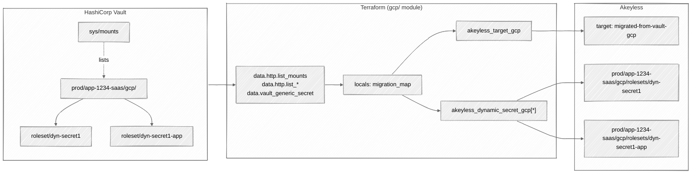

# Architecture Overview

This document describes how the GCP module reads dynamic-secret config from
HashiCorp Vault, what it creates on the Akeyless side, and the naming
convention every migrated object follows.

## Components

| Component | Role |
|---|---|
| HashiCorp Vault | Source of truth. Holds the GCP secrets engine mounts the operator already runs. The migration reads from `sys/mounts` and from each per-app `<env>/<app>/gcp/` mount. |
| Vault token | Token passed via `var.vault_token`. Needs `read` on `sys/mounts` plus `read` and `list` on every `<env>/<app>/gcp/{static-account,impersonated-account,roleset}` path. |
| `hashicorp/http` provider | Performs the live LIST against Vault's HTTP API. The `hashicorp/vault` provider has no generic LIST data source, so discovery is done via `data "http"`. |
| `hashicorp/vault` provider | Performs the per-entity reads (`vault_generic_secret`) once names are known. |
| `akeyless-community/akeyless` provider | Creates the target and the dynamic secrets. Always points at *your* gateway's V2 SDK URL, not `api.akeyless.io`. |
| Akeyless target | One `akeyless_target_gcp` resource (default name `migrated-from-vault-gcp`) wraps the parent SA JSON. Shared by every migrated dynamic secret across all apps. |
| Parent service account | A long-lived Google SA whose JSON key sits inside the Akeyless target. Akeyless uses it to mint per-lease credentials for the child SAs the dynamic secrets reference. |
| Akeyless dynamic secret | One `akeyless_dynamic_secret_gcp` per discovered Vault entity, named `<env>/<app>/gcp/rolesets/<entity_name>`. |

## High-level architecture



Discovery is live. Every plan re-runs `GET sys/mounts`, filters to
`type == "gcp"`, and lists each mount. There is no operator-maintained
inventory. Adding or removing a Vault mount causes the next plan to add or
remove the corresponding Akeyless dynamic secrets.

## Naming convention

Every Akeyless dynamic secret name is fully derived from the Vault mount
path and the entity name:

```
<env>/<app>/gcp/rolesets/<entity_name>
```

`<env>` and `<app>` come from segments 1 and 2 of the Vault mount path.
`<entity_name>` is the literal LIST result key from Vault.

Each application has exactly one GCP mount: `<env>/<app>/gcp/`. The
Kubernetes vs non-Kubernetes split is at the entity level inside that
single mount. The convention is to use an `-app` suffix on the entity
name for the Kubernetes variant of a logical secret. Both entities live
under the same mount:

```
Vault mount:     prod/app-1234-saas/gcp/
Vault entity:    prod/app-1234-saas/gcp/roleset/dyn-secret1       (non-Kubernetes)
Vault entity:    prod/app-1234-saas/gcp/roleset/dyn-secret1-app   (Kubernetes)
Akeyless DS:     prod/app-1234-saas/gcp/rolesets/dyn-secret1
Akeyless DS:     prod/app-1234-saas/gcp/rolesets/dyn-secret1-app
```

The tool does not synthesize the `-app` variant. The operator creates
both entities directly in Vault; see
[`03-vault-structure.md`](03-vault-structure.md).

## All three Vault types collapse into `gcp/rolesets/`

The literal folder is `gcp/rolesets/` regardless of the underlying Vault
entity type. The rationale is that all three become Akeyless dynamic secrets
in fixed-SA mode, and "rolesets" is the operator-facing concept the rest of
the platform uses.

| Vault entity                       | Akeyless DS path                                  | `gcp_cred_type`                                                    |
|------------------------------------|---------------------------------------------------|--------------------------------------------------------------------|
| `gcp/static-account/<name>`        | `<env>/<app>/gcp/rolesets/<name>`                 | `key` if Vault `secret_type=service_account_key`, else `token`.    |
| `gcp/impersonated-account/<name>`  | `<env>/<app>/gcp/rolesets/<name>`                 | Always `token`.                                                    |
| `gcp/roleset/<name>`               | `<env>/<app>/gcp/rolesets/<name>`                 | Always `token`. SA email comes from `var.roleset_sa_overrides`.    |

## Data flow: one `terraform plan`, end to end

1. `data "http" "list_mounts"` calls `GET <vault_address>/v1/sys/mounts`.
2. `locals.gcp_mounts` filters the response to `type == "gcp"` and parses
   each key as `<env>/<app>/gcp`. Anything that does not split into exactly
   three non-empty segments with the literal `gcp` as the third segment
   lands in `local.invalid_mount_paths` and the plan fails at the
   `akeyless_dynamic_secret_gcp` precondition.
3. For each surviving mount, three `data "http"` resources LIST
   `<mount>/static-account`, `<mount>/impersonated-account`, and
   `<mount>/roleset`. 200 means parse `data.keys`; 404 means empty;
   anything else fails the plan with the offending path.
4. For each `(mount, kind, name)` triple, `vault_generic_secret` reads the
   entity. The module pulls `service_account_email`, `secret_type`, and
   `token_scopes`.
5. `locals.migration_map` builds one record per entity, keyed
   `<env>/<app>/<vault_type>/<entity_name>`, with the computed Akeyless
   path `<env>/<app>/gcp/rolesets/<entity_name>` attached.
6. `akeyless_target_gcp.migrated_from_vault` is created (or reused) with
   `gcp_key = base64encode(var.parent_sa_credentials)`.
7. `akeyless_dynamic_secret_gcp.migrated[*]` creates one DS per
   `migration_map` entry. Plan fails up-front if any roleset lacks an
   entry in `var.roleset_sa_overrides` keyed `<env>/<app>/<roleset_name>`.

## Why a single shared target

One `akeyless_target_gcp` is reused across every migrated dynamic secret in
every app. The target wraps the parent SA's JSON key. The parent SA holds
the IAM bindings (`roles/iam.serviceAccountTokenCreator`,
`roles/iam.serviceAccountKeyAdmin`) Akeyless needs to mint per-lease
credentials against the child SAs each dynamic secret references. There is
no per-app or per-env target. The operator can switch to multiple targets
later by templating `var.akeyless_target_name`, but the default shape is
one target.

## Network requirements

The Terraform host must reach:

- The Vault server, on whatever port `var.vault_address` points at.
- The Akeyless gateway, on whatever port `var.akeyless_gateway_url`
  points at.

The Akeyless gateway must reach Google's IAM Credentials API
(`iamcredentials.googleapis.com`) at lease-issue time, since that is where
it actually mints the per-lease credentials.

## Next steps

- [Prerequisites](02-prerequisites.md). Verify you have the Vault token
  caps, the Akeyless access ID, and the local tools needed to run the plan.
